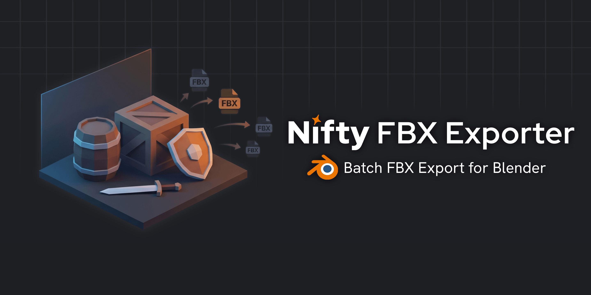
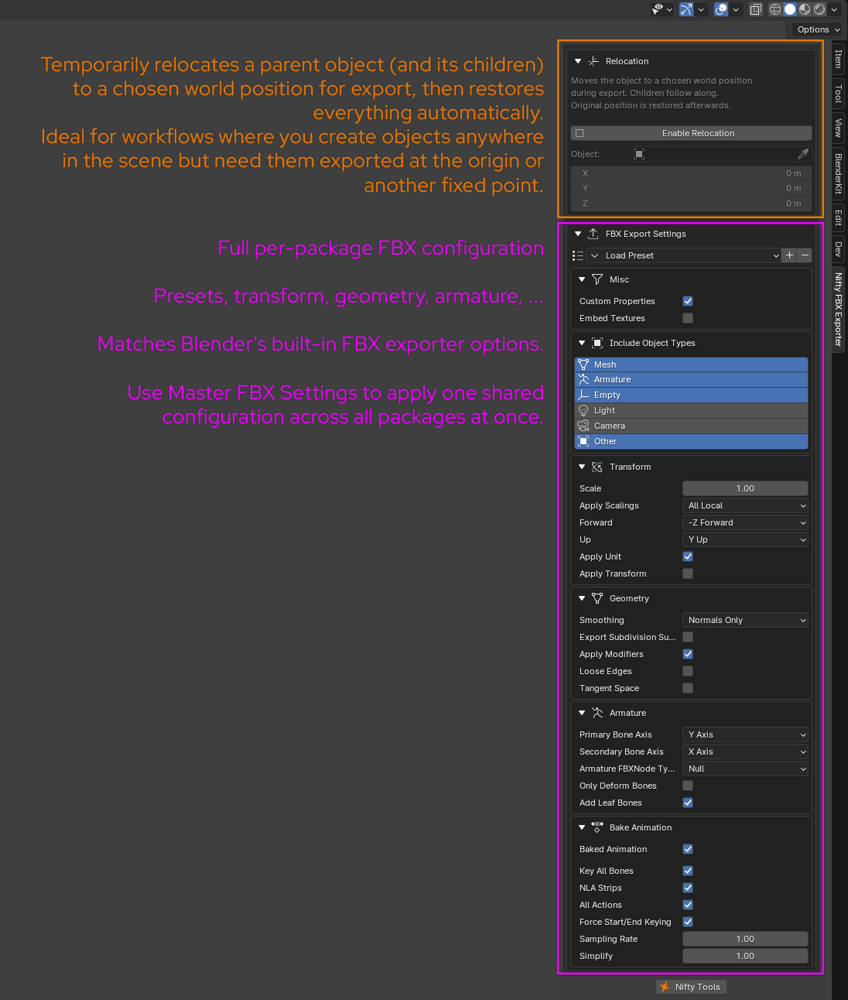

   

  
  
  

---

### 📝 About

  <strong>Batch FBX Export for Blender</strong> 
  <em>Define export packages. Assign objects and collections. Hit export. 
  Settings, paths, and presets are saved with your .blend file — no need to reconfigure.</em>

---

### Overview

| | |
|---|---|
| **What** | Batch-export named groups of objects/collections as individual .fbx files |
| **Where** | `View3D > Sidebar > Nifty FBX Exporter` |
| **Blender** | 4.0+ |
| **License** | Free for personal and commercial use — no resale |

---

### ⚙️ Setup

1. Download the latest `.zip` from the [Releases page](https://github.com/AlexStock3D/Blender-Addon-Nifty-FBX-Exporter/releases)
2. In Blender, go to **Edit > Preferences > Add-ons**
3. Click **Install** and select the downloaded `.zip` file
4. Enable the addon by checking the checkbox next to **Nifty FBX Exporter**

---

### 🚀 Getting started

1. Open the **Nifty FBX Exporter** tab in the 3D Viewport sidebar
2. Add a package (`+` button or create from a collection)
3. Give it a name and output path
4. Assign collections and/or objects
5. Adjust FBX settings if needed
6. Click **Export Selected** or **Export All**

---

### 🖥️ User Interface

  

  

---

### ✨ Features

**📦 Export packages**
Group objects and collections into named packages, each with its own output path and FBX settings. Duplicate, reorder, or remove packages as needed.

**🎯 Flexible content assignment**
Add entire collections or individual objects to a package. Use the eyedropper to add what's currently selected in the viewport, or create a package directly from selected collections in one click.

**🔧 Per-package FBX settings & presets**
Full FBX export configuration per package — Transform, Geometry, Armature, Animation, and more. Load and save presets compatible with Blender's built-in FBX exporter.

**🔀 Relocation**
Temporarily move a parent object (and all its children) to a target position during export. Positions are restored automatically afterwards.

**⚡ Auto-export on save**
Optionally re-export all packages every time the .blend file is saved.

**🏷️ Filename prefix & suffix**
Append a global prefix and/or suffix to all exported filenames without renaming your packages.

**🌐 Master export settings override**
Override all per-package output paths or FBX settings with a single master configuration — useful when you want all packages to share the same destination or export preset.

**✅ Active package filtering**
Mark individual packages as active or inactive. Export All only processes active packages, so you can skip specific ones without deleting them.

**🔍 Object type filtering**
Per-package control over which object types are included in the export: Mesh, Armature, Empty, Light, Camera, and Other.

**🛡️ Non-destructive export**
Selection, active object, edit mode, and object visibility are fully restored after every export — nothing in your scene is permanently changed.

**🖱️ Viewport tools**
Select or isolate a package's objects directly from the panel. Hidden and excluded objects are automatically revealed during export, and local view is exited and restored automatically.

---

### 📄 License

MIT License + Commons Clause — free to use personally and commercially, including in client work and game projects. The addon itself may not be resold or relicensed for a fee. See [LICENSE](LICENSE) for full terms.

---

> Inspired by [Quick Exporter](https://github.com/Wildergames/blender-quick-exporter) by Tony Coculuzzi/Wildergames.*

> **Note:** This addon was developed with the assistance of AI.
